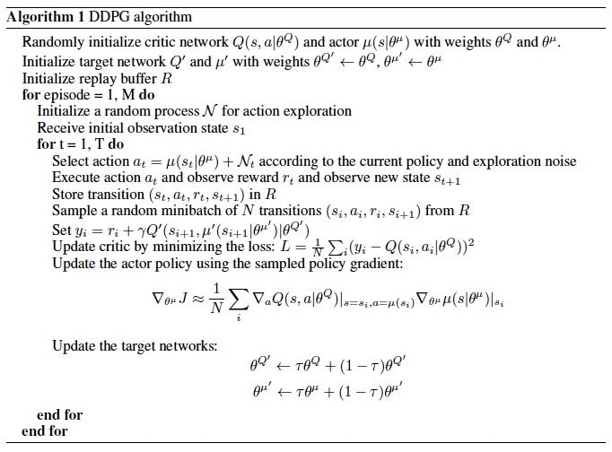
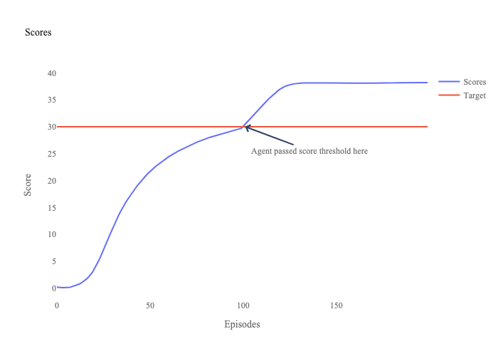
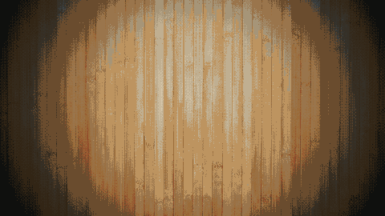

# Solve Reacher Unity Environment with DDPG

## DDPG Model Details

The deep deterministic policy gradient (DDPG) was introduced by Google Deepmind in their Continuous Control with Deep Reinforcement Learning [paper](https://arxiv.org/abs/1509.02971). DDPG uses Deep Q-Learning ideas to solve continuous action environments. DDPG uses a deterministic policy, which allows it to ouput actions directly from a deep neural network (DNN).


DDPG consists of an actor and a critic DNN. The actor ouputs an action based on the state. Critic ouputs Q-value based on state and action. This Q-value is the expected future reward.

In this project, I used a six-layer fully-connected network for both actor and critic.

Model details:

- Actor
    - Layer one
        - Input size: State dimension
        - Units:400
        - Activation: ReLU
    - Layer two
        - Units: 300
        - Activation: ReLU
    - Layer three
        - Units: 200
        - Activation: ReLU
    - Layer four
        - Units: 100
        - Activation: ReLU
    - Layer five
        - Units: 50
        - Activation: ReLU
    - Layer six
        - Output size: Number of Actions
        - Activation: tanh


- Critic
    - Layer one
        - Input size: State dimension
        - Units:400
        - Activation: ReLU
    - Layer two
        - Units: 300 + State dimension
        - Activation: ReLU
    - Layer three
        - Units: 200
        - Activation: ReLU
    - Layer four
        - Units: 100
        - Activation: ReLU
    - Layer five
        - Units: 50
        - Activation: ReLU
    - Layer six
        - Output size: 1
        - Activation: Linear

Here is the DDPG algorithm:



*This Image is taken from the original paper [here](https://arxiv.org/abs/1509.02971).*

## Training

To train an agent, I used the following hyperparameters:

- Hyperparameters:
    - Replay buffer size: 1e6
    - Batch size: 1024
    - Discount factor (gamma): 0.99
    - Soft update weights factor (tau): 1e-3
    - Actor learning rate: 1e-4
    - Critic learning rate: 1e-3
    - Weight decay coefficient: 0
    - Noise distribution: Ornstein Uhlenbeck process

Replay buffer is a memory of different actions and environment trajectories. The batch size indicates how many trajectories to sample from replay buffer for training the actor. The discount factor is used to calculate Q targets. The learning rates are used for training the actor and critic DNNs. I used AdamW optimization with a weight decay cofficient of 0.

### Training Attempts

In my first attempt, I used shallower networks for critic and actor. Those network consisted of 3 layers each. I also used a normal distribution for adding noise to actions. The model did not reach the desired score for 2000 episodes. 

I increased the model networks by adding extra layers. The model scores improved a bit but did not reach the desired score for about 1000 episodes.

I changed the noise to Ornstein Uhlenbeck process. The model was trained for 101 episodes to pass the score of 30 on average for all agents over pas 100 episodes.

## Results

On my machine, the environment was solved in 101 episodes:

```
Episode 95	Average Score: 29.26
Episode 96	Average Score: 29.35
Episode 97	Average Score: 29.43
Episode 98	Average Score: 29.52
Episode 99	Average Score: 29.61
Episode 100	Average Score: 29.69
Episode 101	Average Score: 30.08

Environment solved in 101 episodes!	Average Score: 30.08
Trained model weights saved to: checkpoint_101.pth
```



Here is a video of untrained vs trained models:
[](https://youtu.be/WXqnsGrODL4)

## Future Work

In future, I plan to update the repo to use other algorithms such as Distributed Distributional Deterministic Policy Gradients (D4PG) to solve the environment.

## Author
  - **Sina Fathi-Kazerooni** - 
    [Website](https://sinafathi.com)
